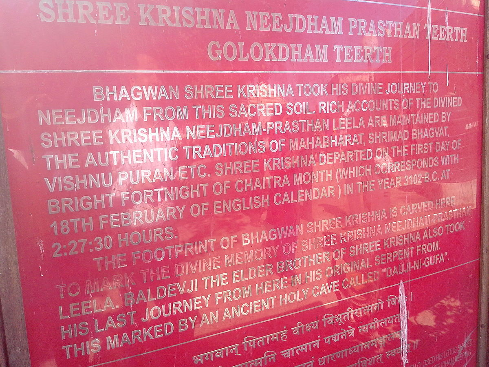

> ## **Exploring the Complete Life Cycle of Creator God Brahma & the Age of the Universe According to Vedas**: 
- The lifespan of Brahma (creator god) is described in profound terms, reflecting the intricate cycles of creation and dissolution that govern the universe. Here's a breakdown of Brahma's lifespan and the cosmic rhythms associated with it:

### 100 Years (Lifespan: 2 Parardhas) of Brahma:

:::simple
   1. **Brahma's Lifespan**: Brahma, the creator god, lives for 100 of his years.
   2. **Each Year Structure**: A Brahmaic year consists of 360 days and nights.
   3. **Total Duration**: The total duration of Brahma's life is **311.04 trillion human years**.
:::

### 50 Years (Parardhas) of Brahma:

:::simple
   1. **Parardha Definition**: Brahma's 100-year life is divided into two 50-year periods, each known as a Parardha.
   2. **In a Maha-Kalpa**: In a 100-year Maha-Kalpa, there are a total of 36,000 full days. This includes 36,000 Kalpas (days proper) and 36,000 Pralayas (nights).
:::

### 1 Year of Brahma:

:::simple
   1. **Each Year Structure**: A Brahmaic year consists of 12 months.
   2. **Duration**: 3.1104 trillion human years.
:::

### 1 Month of Brahma:

:::simple
   1. **Each Month Structure**: A Brahmaic month consists of 30 days (Kalpa) & nights (Pralaya).
   

      
A list of 30 kalpa (days) name as mentioned in the <b>Matsya Purana</b>

      <table>
         <tr>
            <th>Kalpa Number</th>
            <th>30 Kalpa (Day) Name</th>
         </tr>
         <tr>
            <td>1</td>
            <td align="center">Sveta (current day)</td>
         </tr>
         <tr>
            <td>2</td>
            <td>Nilalohita</td>
         </tr>
         <tr>
            <td>3</td>
            <td>Vamadeva</td>
         </tr>
         <tr>
            <td>4</td>
            <td>Rathantara</td>
         </tr>
         <tr>
            <td>5</td>
            <td>Raurava</td>
         </tr>
         <tr>
            <td>6</td>
            <td>Deva</td>
         </tr>
         <tr>
            <td>7</td>
            <td>Vrhat</td>
         </tr>
         <tr>
            <td>8</td>
            <td>Kandarpa</td>
         </tr>
         <tr>
            <td>9</td>
            <td>Sadya</td>
         </tr>
         <tr>
            <td>10</td>
            <td>Isana</td>
         </tr>
         <tr>
            <td>11</td>
            <td>Tamah</td>
         </tr>
         <tr>
            <td>12</td>
            <td>Sarasvata</td>
         </tr>
         <tr>
            <td>13</td>
            <td>Udana</td>
         </tr>
         <tr>
            <td>14</td>
            <td>Garuda</td>
         </tr>
         <tr>
            <td>15</td>
            <td>Kaurma</td>
         </tr>
         <tr>
            <td>16</td>
            <td>Narasimha</td>
         </tr>
         <tr>
            <td>17</td>
            <td>Samana</td>
         </tr>
         <tr>
            <td>18</td>
            <td>Agneya</td>
         </tr>
         <tr>
            <td>19</td>
            <td>Soma</td>
         </tr>
         <tr>
            <td>20</td>
            <td>Manava</td>
         </tr>
         <tr>
            <td>21</td>
            <td>Tatpuman</td>
         </tr>
         <tr>
            <td>22</td>
            <td>Vaikuṇṭha</td>
         </tr>
         <tr>
            <td>23</td>
            <td>Lakṣmi</td>
         </tr>
         <tr>
            <td>24</td>
            <td>Savitri</td>
         </tr>
         <tr>
            <td>25</td>
            <td>Aghora</td>
         </tr>
         <tr>
            <td>26</td>
            <td>Varaha</td>
         </tr>
         <tr>
            <td>27</td>
            <td>Vairaja</td>
         </tr>
         <tr>
            <td>28</td>
            <td>Gauri</td>
         </tr>
         <tr>
            <td>29</td>
            <td>Mahesvara</td>
         </tr>
         <tr>
            <td>30</td>
            <td>Pitr</td>
         </tr>
      </table>
   

   2. **Duration**: 259.2 billion human years.
:::

### 1 Day(Kalpa) and 1 Night (Pralaya) of Brahma:

:::simple
   1. Brahma's **day, known as a Kalpa**, lasts for **4.32 billion years**.
   2. It is followed by a **night, or Pralaya**, of equal length.
   3. **Structure of a Kalpa**:
       - A Kalpa consists of 1,000 Chatur-Yugas.
       - Within a Kalpa, there are 14 Manvantaras (epochs) and 15 Manvantara-Sandhyas (transitional periods).
       - At the start of Brahma's day, creation unfolds as he is reborn, forming planets and the first living entities.
       - At the end of his day, Brahma and his creations undergo partial dissolution, entering a state of unmanifestation.
   4. **Duration of kalp**: 
       - **Started in the Past**: Approximately 1.97 billion years ago.
       - **Ends in the Future**: Estimated to conclude in about 2.35 billion years.

    
:::

### Maha-Kalpa and Maha-Pralaya:

:::simple
   1. Brahma's entire lifespan is called a Maha-Kalpa, lasting for 311.04 trillion years.
   2. It is followed by a Maha-Pralaya, a period of full dissolution, lasting for an equivalent length.
   3. Prakriti, the basis of the universe, is manifest at the start and unmanifest at the end of a Maha-Kalpa.
   4. **Duration of Maha-Kalpa**:
      - **Started in the Past**: Roughly 155.52 trillion years ago.
      - **Ends in the Future**: Expected to conclude in about 155.52 trillion years.
:::

## Current State within Brahma's Life Cycle:
> 
   
   1. **51st year of 100 (2nd half or parardha)**.
   2. **1st month of 12**.
   3. **1st kalpa/day (Shveta-Varaha Kalpa) of 30**.
   - 
      | Kalpa Number | Kalpa Name      |
      |--------------|-----------------|
      | 1/30         | Sveta-Varaha |
   4. **7th manvantara (Vaivasvatha Manu) of 14**.
   
   5. **28th chatur-yuga of 71**.
   
   6. **4th yuga (Kali-yuga) of 4**.
   

## Start date of current Kali Yuga:
> 
   - According to the **Surya Siddhanta**, Kali Yuga began at _**midnight (00:00) on 18 February 3102 BCE**_. This sacred date also aligns with the departure of Lord Krishna from the earthly realm, returning to the divine abode of Vaikuntha. The sanctity of this moment is memorialized at the temple of Bhalka, the very site of this celestial event.
   - The significance of **18th February 3102 BCE** extends beyond a mere astronomical calculation; it marks the end of Dvapara Yuga and the initiation of the current age of Kali Yuga. This transition holds profound spiritual and cultural importance, intertwining cosmic time with the divine narrative of Lord Krishna's departure.
    
  - #### **Current Age of Kali Yuga**: 
      - The current age of Kali-Yuga is **5126 years** from **midnight (00:00) on 18 February 3102 BCE to 18th February 2024**.

:::::tip Calculating Brahma's 100 Years into Human Years
:::simple
Let's break down Brahma's 100-year lifespan into human years step by step:
:::

### Basic Conversion Factors:
- **100 years** = 1 * 100 years
   - **1 year** = 12 months
   - **1 month** = 30 days (kalpa) + 30 nights (pralaya)
- **100 years** = 36,000 days (kalpa) + 36,000 nights (pralaya)

### Yuga Structure:
- **1 day (kalpa)** = 14 manvantara + 15 manvantara-sandhya
- **1 night (pralaya)** = 14 manvantara + 15 manvantara-sandhya
- **1 manvantara** = 71 chatur-yuga
- **1 manvantara-sandhya** = 1 satya-yuga
- **1 chatur-yuga** = 1 satya(krta)-yuga + 1 treta-yuga + 1 dvapara-yuga + 1 kali-yuga
     - 1 satya-yuga = 4 * 1 kali-yuga
     - 1 treta-yuga = 3 * 1 kali-yuga
     - 1 dvapara-yuga = 2 * 1 kali-yuga
     - 1 kali-yuga = 432,000 human years

### Yuga Duration:
- **1 kali-yuga** = 4,32,000 human years
- **1 chatur-yuga** = (4+3+2+1) kali-yuga   
   &emsp;&emsp;&emsp;&emsp;&emsp;&emsp;&emsp;= 10 kali-yuga
- **1 manvantara** = 71 chatur-yuga   
   &emsp;&emsp;&emsp;&emsp;&emsp;&emsp;&ensp;= 71 x 10 kali-yuga   
   &emsp;&emsp;&emsp;&emsp;&emsp;&emsp;&ensp;= 710 kali-yuga
- **1 manvantara-sandhya** = 1 satya-yuga   
   &emsp;&emsp;&emsp;&emsp;&emsp;&emsp;&emsp;&emsp;&emsp;&emsp;&emsp;= 4 kali-yuga
- **1 day (kalpa)** = 14 manvantara + 15 manvantara-sandhya    
   &emsp;&emsp;&emsp;&emsp;&emsp;&emsp;&ensp;= 14 x 710 kali-yuga + 15 x 4 kali-yuga    
   &emsp;&emsp;&emsp;&emsp;&emsp;&emsp;&ensp;= (9940 + 60) kali-yuga    
   &emsp;&emsp;&emsp;&emsp;&emsp;&emsp;&ensp;= 10,000 kali-yuga
- **1 night (pralaya)** = 14 manvantara + 15 manvantara-sandhya    
   &emsp;&emsp;&emsp;&emsp;&emsp;&emsp;&emsp;&emsp;= 14 x 710 kali-yuga + 15 x 4 kali-yuga    
   &emsp;&emsp;&emsp;&emsp;&emsp;&emsp;&emsp;&emsp;= (9940 + 60) kali-yuga    
   &emsp;&emsp;&emsp;&emsp;&emsp;&emsp;&emsp;&emsp;= 10,000 kali-yuga

### Conversion:
- **100 years** = 36,000 days (kalpa) + 36,000 nights (pralaya)   
   &emsp;&emsp;&emsp;&emsp;&emsp;= 2 x 36,000 x 10,000 kali-yuga    
   &emsp;&emsp;&emsp;&emsp;&emsp;= 720,000,000 kali-yuga    
   &emsp;&emsp;&emsp;&emsp;&emsp;= 720,000,000 x 4,32,000 human years    
   &emsp;&emsp;&emsp;&emsp;&emsp;= **311,040,000,000,000 human years**

This calculation shows that Brahma's 100-year lifespan equates to a staggering 311,040,000,000,000 human years in Hindu cosmology.

::::info-tip Current Exact Date & Time of Creator God Brahma with respect to 100 years of Brahma

### Setting the Stage: Current Time
As per the given parameters:

- **Current Year of 100** &emsp;&emsp;&emsp;&emsp;&emsp;&emsp;&emsp;&emsp;&emsp;&emsp;&ensp;$$=$$ 50 (Completed) + 1 (current year)
- **Current month of 12** &emsp;&emsp;&emsp;&emsp;&emsp;&emsp;&emsp;&emsp;&emsp;&emsp;$$=$$ 1
- **Current day(Kalpa) of 30** &emsp;&emsp;&emsp;&emsp;&emsp;&emsp;&emsp;&ensp;$$=$$ 1
- **Current manvantara of 14** &emsp;&emsp;&emsp;&emsp;&emsp;&emsp;&emsp; $$=$$ 6 (Completed) + 1(current)
- **Current manvantara-sandhya of 15** &emsp;&emsp;&ensp; $$=$$ 7 (Completed)
- **Current chatur-yuga of 71** &emsp;&emsp;&emsp;&emsp;&emsp;&emsp;&emsp;$$=$$ 27 (Completed) + 1(current)
- **Current yuga of 4** &emsp;&emsp;&emsp;&emsp;&emsp;&emsp;&emsp;&emsp;&emsp;&emsp;&emsp;$$=$$ 4 (Kali-yuga)
- **Current kali-yuga time (in Human years)** $$=$$ 5126 years

Thus, the current date is:--> **DD/MM/YYYY** $$=$$ **01/01/51**.

### God Brahma's Time Scale: 
<table>
   <tr>
      <th>Human Time</th>
      <th>God Bramha Time</th>
   </tr>
   <tr>
      <td>311,040,000,000,000 yr</td>
      <td>100 yr</td>
   </tr>
   <tr>
      <td>4,32,000 yr</td>
      <td>4.32 sec</td>
   </tr>
   <tr>
      <td>1,00,000 yr</td>
      <td>1 sec</td>
   </tr>
   <tr>
      <td>1 yr</td>
      <td>10 micro-sec</td>
   </tr>
   <tr>
      <td>36 days</td>
      <td>1 micro-sec</td>
   </tr>
</table>

### Calculations:
- Total human years in 6 manvantara = 6 x 710 kali-yuga   
   &emsp;&emsp;&emsp;&emsp;&emsp;&emsp;&emsp;&emsp;&emsp;&emsp;&emsp;&emsp;&emsp;&emsp;&emsp;&emsp;&ensp; = 4260 kali-yuga   
   &emsp;&emsp;&emsp;&emsp;&emsp;&emsp;&emsp;&emsp;&emsp;&emsp;&emsp;&emsp;&emsp;&emsp;&emsp;&emsp;&ensp; = 4260 x 432,000   
   &emsp;&emsp;&emsp;&emsp;&emsp;&emsp;&emsp;&emsp;&emsp;&emsp;&emsp;&emsp;&emsp;&emsp;&emsp;&emsp;&ensp; = 1,840,320,000 human year
- Total human years in 7 manvantara-sandhya = 7 x 4 kali-yuga   
   &emsp;&emsp;&emsp;&emsp;&emsp;&emsp;&emsp;&emsp;&emsp;&emsp;&emsp;&emsp;&emsp;&emsp;&emsp;&emsp;&emsp;&emsp;&emsp;&emsp;&emsp; = 28 kali-yuga   
   &emsp;&emsp;&emsp;&emsp;&emsp;&emsp;&emsp;&emsp;&emsp;&emsp;&emsp;&emsp;&emsp;&emsp;&emsp;&emsp;&emsp;&emsp;&emsp;&emsp;&emsp;  = 28 x 432,000   
   &emsp;&emsp;&emsp;&emsp;&emsp;&emsp;&emsp;&emsp;&emsp;&emsp;&emsp;&emsp;&emsp;&emsp;&emsp;&emsp;&emsp;&emsp;&emsp;&emsp;&emsp;  = 12,096,000 human year
- Total human years in 27 chatur-yuga = 27 x 10 kali-yuga   
   &emsp;&emsp;&emsp;&emsp;&emsp;&emsp;&emsp;&emsp;&emsp;&emsp;&emsp;&emsp;&emsp;&emsp;&emsp;&emsp;&emsp;&ensp;= 270 kali-yuga   
   &emsp;&emsp;&emsp;&emsp;&emsp;&emsp;&emsp;&emsp;&emsp;&emsp;&emsp;&emsp;&emsp;&emsp;&emsp;&emsp;&emsp;&ensp;= 270 x 432,000   
   &emsp;&emsp;&emsp;&emsp;&emsp;&emsp;&emsp;&emsp;&emsp;&emsp;&emsp;&emsp;&emsp;&emsp;&emsp;&emsp;&emsp;&ensp;= 1,166,440,000 human year
- Total human years in 9 kali-yuga + 5126 years = 9 x 4,32,000 + 5126   
   &emsp;&emsp;&emsp;&emsp;&emsp;&emsp;&emsp;&emsp;&emsp;&emsp;&emsp;&emsp;&emsp;&emsp;&emsp;&emsp;&emsp;&emsp;&emsp;&emsp;&emsp;&emsp;= 3,888,000 + 5126   
   &emsp;&emsp;&emsp;&emsp;&emsp;&emsp;&emsp;&emsp;&emsp;&emsp;&emsp;&emsp;&emsp;&emsp;&emsp;&emsp;&emsp;&emsp;&emsp;&emsp;&emsp;&emsp;= 3,93,126 human years

Current kalpa total time = 1,840,320,000 + 12,096,000 + 1,166,440,000 + 3,93,126   
   &emsp;&emsp;&emsp;&emsp;&emsp;&emsp;&emsp;&emsp;&emsp;&emsp;&emsp;&ensp;= 3,019,249,126 human years   
   &emsp;&emsp;&emsp;&emsp;&emsp;&emsp;&emsp;&emsp;&emsp;&emsp;&emsp;&ensp;= 3019249126/100000 brahma seconds   
   &emsp;&emsp;&emsp;&emsp;&emsp;&emsp;&emsp;&emsp;&emsp;&emsp;&emsp;&ensp;= 30192.49126 brahma seconds

### Conversion to Time Format:
- **Total Time Elapsed**: 30192.49126 seconds
   - 503.208188 minutes
   - 8 hours, 23.208188 minutes
   - 8 hours, 23 minutes, 12.49128 seconds
   - 8 hours, 23 minutes, 12 seconds, 491280 micro-seconds

:::note God Brahma's curremt Date and Time:
>   - Date = 01 January 51
   - Time = 08:23:12:491280 AM

### In Human Time: 
> 18 February 2024
:::
::::

:::::

## Time Scales Between Humans and Brahma in Hindu Cosmology

Time Scales Between Humans and Brahma in Hindu Cosmology

:::note Time Scales Between Humans and Brahma in Hindu Cosmology:

<table>
   <tr>
      <th>Unit</th>
      <th>Definition</th>
      <th>Human</th>
      <th>Brahma</th>
   </tr>
   <tr>
      <td colspan="4">
         <table>
            <tr>
               <td>Maha-kalpa</td>
               <td>36,000 kalpa & pralaya</td>
               <td>311,040,000,000,000  (311.04 trillion) yr</td>
               <td>100 yr</td>
            </tr>
            <tr>
               <td>Maha-pralaya</td>
               <td>36,000 kalpa & pralaya</td>
               <td>311,040,000,000,000  (311.04 trillion) yr</td>
               <td>100 yr</td>
            </tr>
         </table>
      </td>
   </tr>
   <tr>
      <td>Parardha</td>
      <td>1⁄2 Maha-kalpa</td>
      <td>155,520,000,000,000  (155.52 trillion) yr</td>
      <td>50 yr</td>
   </tr>
   <tr>
      <td colspan="4">
         <table>
            <tr>
               <td>Kalpa</td>
               <td>14 manvantara + 15 manvantara-sandhya</td>
               <td>4,320,000,000  (4.32 billion) yr</td>
               <td>12 hr</td>
            </tr>
            <tr>
               <td>Pralaya</td>
               <td>14 manvantara + 15 manvantara-sandhya</td>
               <td>4,320,000,000  (4.32 billion) yr</td>
               <td>12 hr</td>
            </tr>
         </table>
      </td>
   </tr>
   <tr>
      <td colspan="4">
         <table>
            <tr>
               <td>Manvantara</td>
               <td>71 Catur-yuga</td>
               <td>306,720,000 yr</td>
               <td>51.12 min</td>
            </tr>
            <tr>
               <td>Manvantara-sandhya</td>
               <td>1 Satya-yuga length</td>
               <td>1,728,000 yr</td>
               <td>17.28 s</td>
            </tr>
         </table>
      </td>
   </tr>
   <tr>
      <td>Catur-yuga</td>
      <td>Satya(Krta), Treta, Dvapara & Kali-yugas</td>
      <td>4,320,000 yr</td>
      <td>43.20 s</td>
   </tr>
   <tr>
      <td colspan="4">
         <table>
            <tr>
               <td>Satya(Krta)-yuga</td>
               <td>4 Kali-yugas length</td>
               <td>1,728,000 yr</td>
               <td>17.28 s</td>
            </tr>
            <tr>
               <td>Treta-yuga</td>
               <td>3 Kali-yugas length</td>
               <td>1,296,000 yr</td>
               <td>12.96 s</td>
            </tr>
            <tr>
               <td>Dvapara-yuga</td>
               <td>2 Kali-yugas length</td>
               <td>864,000 yr</td>
               <td>8.64 s</td>
            </tr>
            <tr>
               <td>Kali-yuga</td>
               <td>1 Kali-yugas length</td>
               <td>432,000 yr</td>
               <td>4.32 s</td>
            </tr>
         </table>
      </td>
   </tr>
</table>
:::

